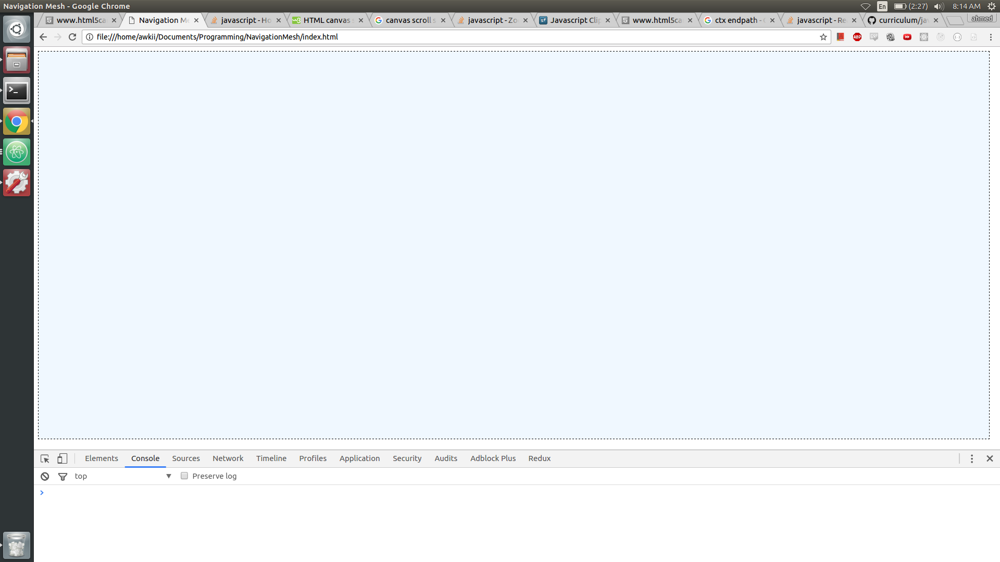

# Precomputational NavMeshes

**Purpose** To demonstrate A* Pathfinding on convex polygons and pre-generated
meshes.

**Difficulty Scale** Hard

**Level of Saddness if this proposal gets rejected again** Immense. :(

## Background
Pathfinding algorithms are always visualized on grids, but maps in the real-world
can rarely ever be represented by neat, orthogonal corners. There are a few different
ways to construct a navigation-mesh, and this project will demonstrate the precommutational method that became popular in point-and-click adventure games in
the late 90s.

## Wireframes
One large canvas with the ability to draw, edit, and execute a meshes

*Stage 1: Draw Mode*
* Player has the option to put nodes onto the screen.
* Polygons drawn by the player can be added or subtracted to get larger Polygons
* Player can also edit the boundaries of existing Polygons

*State 2: Navigation Mode*
* Mesh is computed from polygonal structure
* A hero instance is spawned at the start flag
* The hero navigates towards the end-flog
* The end-flag is draggable, so the hero has to dynamically find new routes

## Technologies
* JS-ClipperLib to add and subtract polygons

## Timeline
### Day 1
* Camera
* User Interface and button clicks
* Polygon addition
* Polygon Mutation

### Day 2
* Mesh genertation logic
* Full Graphical connections part I

### Day 3
* Full graphical connections part ii
* Add storyboarding events and skip buttons

### Day 4
* Submit project & polish

### Bonus
* Add verlet-cloth physics to player to give him a cool cape.
